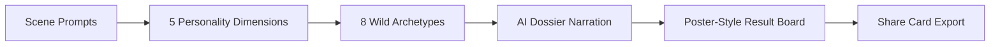
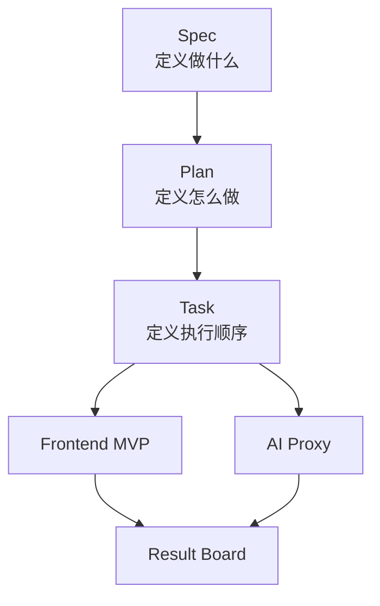

# 野性人格局 | Wild Persona Bureau

一个基于 `SDD（Spec + Plan + Task）` 开发方式构建的 AI 趣味人格实验项目。

`野性人格局` 不做传统 MBTI 套壳，也不做普通动物测试，而是把用户在压力、风险、社交和行动节奏中的选择，映射成一份具有叙事感和分享感的“野性人格档案”。

快速部署与拉取即用说明见：[部署指南](部署指南.md)

## 一分钟看懂

- 这不是“你像什么动物”的普通测试，而是一份带叙事感的野外人格档案
- 用户不是在答考试题，而是在场景里暴露自己的本能反应
- 前端完成 `题目 -> 五维评分 -> 原型匹配 -> 结果海报` 的完整链路
- 后端已接入 `Cloudflare Workers AI` 免费模型，并真实验证通过
- 仓库不是只有代码，还能直接展示 `Spec / Plan / Task` 三文档协同开发方法

## 为什么它更容易让评委记住

- 产品层：结果不是一个标签，而是一份可截图、可分享、可讲故事的 field dossier
- 交互层：题目是带氛围的场景题，不是平铺直叙的“你是 E 还是 I”
- 工程层：项目同时展示了视觉完成度、Prompt 工程链路、AI 代理层和 SDD 方法
- 演示层：没有真实大模型时也能稳定跑 `mock`，有网络时可切 `proxy`，失败时自动 `fallback`

## 产品链路



## SDD 如何驱动这个项目



## 比赛亮点

### 1. 题目设计不老套

- 每题都是轻叙事场景
- 每个选项体现的是反应倾向，不是标准答案
- 用户会觉得自己像在进入一个实验，而不是在做表单

### 2. 结果页有“作品感”

- 结果页面采用实验室档案 + 野性图鉴的混合视觉语言
- 结果不是单纯文字块，而是带海报化排版的可展示产物
- 支持导出分享卡，天然适合录屏、答辩和社媒传播

### 3. AI 接入讲得清楚

- 用户选择先被映射成五维结构化分数
- 分数再被匹配到主原型与次级原型
- Prompt 层只负责把结构化结果转成“档案叙事”
- 弱模型输出过于空泛时，会自动退回本地 dossier engine

### 4. GitHub 也能当答辩材料

- 仓库首页可直接说明产品价值、技术路线和演示顺序
- `docs/` 下保留完整的 `Spec / Plan / Task`
- 评委即使不运行项目，也能快速看懂方法和亮点

## 当前完成度

- 已完成首页、测试页、结果页三张核心页面
- 已实现 10 个场景题、5 维人格评分和 8 个野性原型
- 已实现结果页异步 AI 叙事流程
- 已支持 `mock / proxy / fallback` 三种叙事来源
- 已支持结果页导出分享卡
- 已实现 Node 原生后端代理层
- 已通过 `Cloudflare Workers AI` 免费模型真实联调
- 已加入低质量文案检测与自动回退策略
- 已通过前端构建验证和后端本地烟雾测试

## 演示顺序建议

1. 先打开首页，强调“这不是普通动物测试，而是野外人格档案”
2. 进入测试页，展示场景题而不是常规题库
3. 快速完成几题，说明五维评分和原型匹配逻辑
4. 打开结果页，展示 AI 叙事、五维曲线和分享卡导出
5. 最后回到 GitHub，展示 `Spec / Plan / Task` 三文档和工程结构

更完整的话术资产见：[GitHub Showcase Kit](docs/github-showcase.md)

## SDD 文档

- [Spec](docs/spec.md)
- [Plan](docs/plan.md)
- [Task](docs/task.md)

职责边界：

- `Spec`：定义做什么，定义用户体验、人格模型和产品边界
- `Plan`：定义怎么做，定义技术栈、工程结构、环境配置和联调方案
- `Task`：定义 AI 与人的协作步骤，把工作流拆到可执行颗粒度

## 技术与模型路线

- 前端：`Vue 3 + Vite + TypeScript`
- 状态：`Pinia`
- 路由：`Vue Router`
- 结果导出：`原生 Canvas 海报生成`
- 后端：`Node.js 原生 http + fetch`
- 免费模型：`Cloudflare Workers AI + @cf/meta/llama-3.1-8b-instruct-fast`
- 兼容备选：`Groq + openai/gpt-oss-20b`

## AI 叙事模式

- `mock`：本地回退叙事，用于最稳定的比赛演示
- `proxy`：调用后端代理接口，接入真实免费模型
- `fallback`：代理失败或文案质量过低时自动退回本地叙事

这意味着：

- 没有联网条件时，项目依然可以完整演示
- 有模型时，评委可以看到真实 AI 参与链路
- 弱模型说空话时，结果页也不会失真或掉质感

相关文件：

- [personaNarrator.ts](app/src/prompts/personaNarrator.ts)
- [narrator.ts](app/src/services/narrator.ts)
- [server/openaiProxy.mjs](server/src/openaiProxy.mjs)
- [App Runtime Notes](app/README.md)
- [Server Runtime Notes](server/README.md)

## 本地启动

推荐先在仓库根目录执行一键安装：

```bash
npm run setup
```

如果你只想单独安装前端，也可以执行：

```bash
cd app
npm install
```

最稳的比赛演示方式是前端 `mock` 模式：

- 复制 `app/.env.example` 为 `app/.env.local`
- 保持 `VITE_NARRATOR_MODE=mock`
- 直接启动前端即可完整演示

如果你要演示真实 AI 链路，再启动后端代理：

```bash
npm run dev:server
```

启动前端：

```bash
npm run dev:app
```

默认地址：

- 前端：`http://localhost:5173`
- 后端：`http://localhost:8787`

构建验证：

```bash
npm run build
```

更完整的本地运行、真实 AI 配置、生产部署和验收清单见：[部署指南](部署指南.md)

## 当前工程结构

```text
.
├─ docs/
│  ├─ spec.md
│  ├─ plan.md
│  ├─ task.md
│  └─ github-showcase.md
├─ app/
│  ├─ .env.example
│  ├─ package.json
│  ├─ vite.config.ts
│  └─ src/
│     ├─ components/
│     ├─ data/
│     ├─ pages/
│     ├─ prompts/
│     ├─ router/
│     ├─ services/
│     ├─ stores/
│     ├─ types/
│     └─ utils/
└─ server/
   ├─ .env.example
   ├─ package.json
   └─ src/
      ├─ env.mjs
      ├─ index.mjs
      ├─ narrationSchema.mjs
      └─ openaiProxy.mjs
```

## 下一步打磨方向

1. 继续优化分享卡版式，让截图更像可传播作品
2. 补真实运行截图与录屏封面图
3. 继续收紧免费模型 Prompt，让文案更锋利
4. 如果时间允许，再扩展双人对比模式或历史结果页
